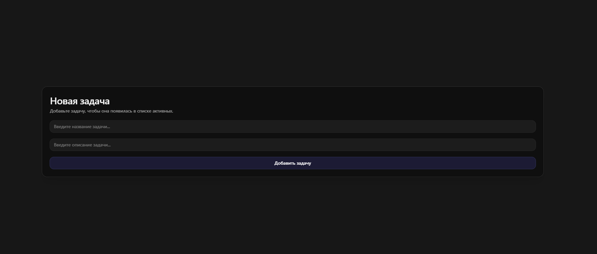
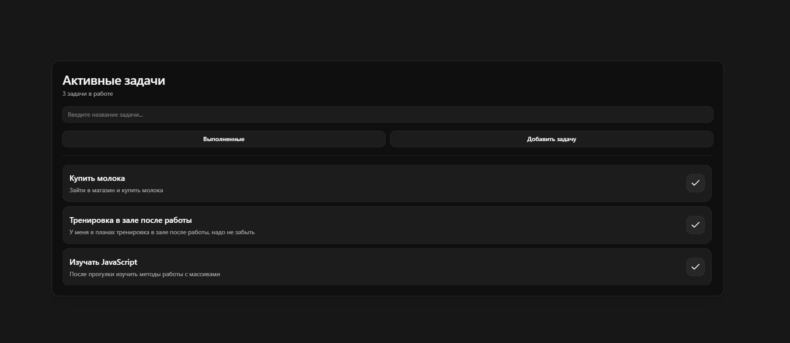
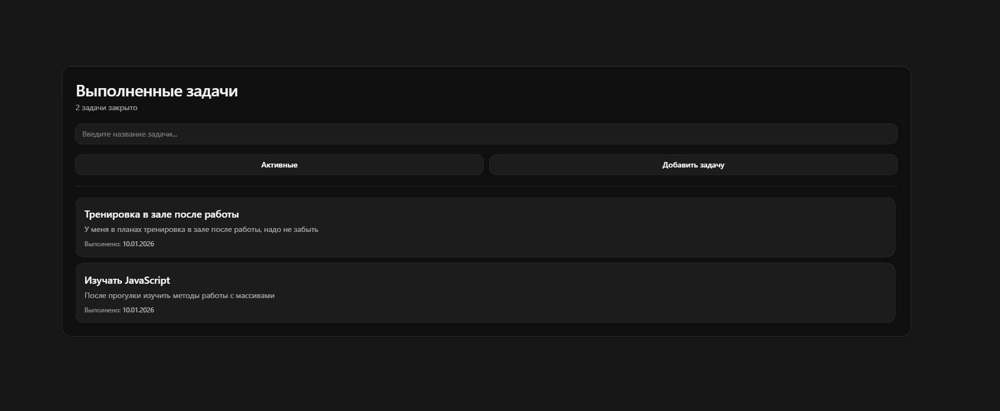

# Simple Todo — мини pet‑проект

Небольшое ToDo‑приложение, которое я сделал специально **простым**, чтобы отработать базовые навыки: React/Next.js (App Router), состояние, работа с формами, валидация и хранение данных на клиенте.

## Возможности

- **Активные задачи**: список + поиск по названию.
- **Добавление задачи**: форма с валидацией (проверка длины и обязательности полей).
- **Выполненные задачи**: отдельный экран со списком + поиск.
- **Завершение задачи**: одним кликом, сохраняется дата выполнения.
- **Сохранение данных**: `localStorage` (ключ `tasks`) — данные не теряются при перезагрузке страницы.
- **UI**: тёмная тема, адаптивная вёрстка.

## Технологии

- **Next.js** (App Router)
- **React 19**
- **TypeScript**
- **Tailwind CSS**
- **ESLint**

## Страницы

- **`/`** — активные задачи (Dashboard)
- **`/add`** — добавление новой задачи
- **`/complete`** — выполненные задачи

## Быстрый старт

Установка зависимостей:

```bash
yarn install
```

Запуск в dev‑режиме:

```bash
yarn dev
```

## Скриншоты




